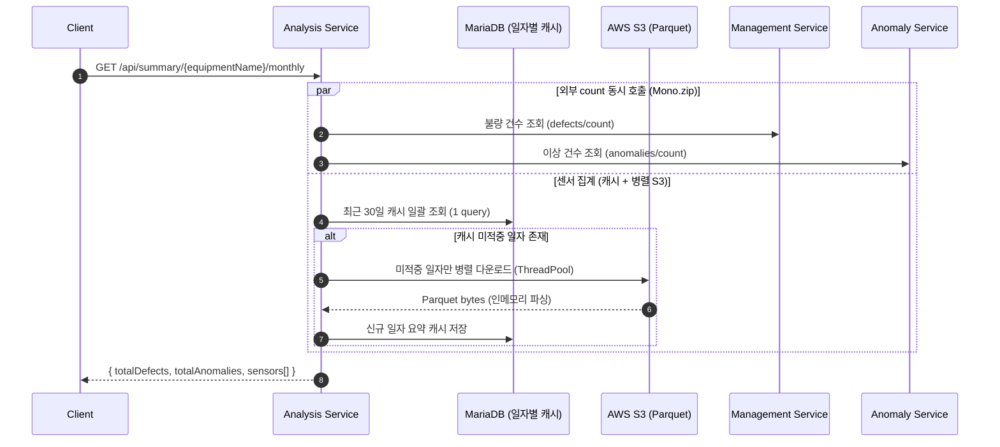

# SIGMA 스마트 팩토리 월간 요약 분석 서비스 (Analysis-Service)

이 프로젝트는 **Spring Boot** 기반의 마이크로서비스로, 스마트 팩토리 설비별 **월간 운영 요약 리포트**를 제공합니다. S3에 일자별로 적재된 센서 요약(Parquet)을 집계하고, `management-service`/`anomaly-service`와 통신해 최근 30일간 **불량 건수·이상 건수·센서 평균값**을 하나의 응답으로 조립합니다.

데이터 흐름은 전부 **읽기 전용(inbound)** 이며, S3·외부 서비스 어디에도 쓰기/발행을 하지 않습니다. 대량의 S3 왕복을 견디기 위해 **병렬 조회 / 인메모리 Parquet 파싱 / 외부 호출 동시화 / 일자별 영구 캐시** 4가지 최적화를 적용했습니다.

---

## 아키텍처 및 시스템 흐름도

월간 요약 1건을 조립하기까지의 흐름입니다. 캐시 미적중 일자만 S3에서 병렬로 읽고, 외부 count 2건은 S3 집계와 동시에 진행됩니다.



---

## 프로젝트 구조

```text
src/main/java/com/factory/analysis_service/
  ├── config/              # 아키텍처 설정
  │   ├── S3Config.java        # S3Client 빈 (StaticCredentials / IAM 분기)
  │   ├── AwsS3Properties.java # cloud.aws.* 바인딩
  │   ├── WebClientConfig.java # 외부 서비스 호출용 WebClient
  │   └── AsyncConfig.java     # S3 병렬 조회 전용 ExecutorService
  ├── controller/          # REST API (월간 요약 / S3 디버그)
  ├── dto/                 # MonthlySummaryResponseDTO, SensorSummaryDTO
  ├── entity/              # DailySensorSummary (일자별 요약 캐시, 복합키)
  ├── repository/          # DailySensorSummaryRepository (JPA)
  ├── parquet/             # InMemoryInputFile (디스크 없는 Parquet 리더)
  └── service/             # S3SummaryService (집계 핵심 로직)

src/main/resources/
  ├── application.yml          # 기본 설정 (UTC 타임존 고정 포함)
  ├── application-dev.yml      # dev 프로파일 (MariaDB)
  ├── application-local.yml    # local 프로파일
  └── application-prod.yml     # prod 프로파일
```

데이터 적재 규약 — S3는 `설비/일자` 폴더당 Parquet 1개를 둡니다.

```text
summary-data/date=2026-05-29/equipmentId=EQP-DEPOSITION-001/part-0.parquet
  스키마: { sensorType: string, unit: string, avg_value: double }
```

---

## 핵심 기술 및 구현 상세

### 1. 30일 S3 조회 병렬화 (`AsyncConfig`, `S3SummaryService`)

과거 일자의 요약은 서로 독립적이고 불변이므로 완전 병렬화가 가능합니다. `parallelStream`의 공용 ForkJoinPool 대신 **전용 고정 스레드풀(8)** 을 두어, blocking S3 I/O가 애플리케이션의 다른 병렬 작업을 굶기지 않게 합니다. 미적중 일자들을 `CompletableFuture`로 동시 다운로드하고 마지막에 병합합니다.

> 직렬 30회 왕복 → "가장 느린 한 번" 수준으로 단축. (호출 스레드와 S3 풀이 분리되어 join 데드락도 방지)

### 2. 디스크 없는 인메모리 Parquet 파싱 (`InMemoryInputFile`)

기존 구현은 `getObjectAsBytes()`로 이미 메모리에 올라온 바이트를 다시 임시파일에 쓰고(`Files.write`) 디스크에서 재차 읽은 뒤 삭제했습니다. Parquet은 footer seek 때문에 random-access가 필요할 뿐 디스크가 필요한 것은 아니므로, **byte[] 위에서 seek/read를 직접 제공**하는 `InputFile`을 구현해 디스크 I/O를 0으로 만들었습니다. (read-only 컨테이너 환경에도 안전)

### 3. 외부 count 동시 호출 (`fetchCountsAsync`)

`management`/`anomaly` 두 count 호출은 서로 독립적이므로 `Mono.zip`으로 **동시에 구독**해 병렬 실행합니다. 나아가 이 두 호출을 S3 집계 작업과도 겹쳐 전체 레이턴시를 "가장 오래 걸리는 한 워크스트림"으로 수렴시킵니다. 호출 실패 시 해당 count는 `0`으로 폴백되어 전체 응답은 죽지 않습니다.

### 4. 일자별 영구 캐시 (`DailySensorSummary`)

월간 요약은 항상 "1~30일 전"을 보므로 매 호출마다 29/30이 겹칩니다. 과거 일자의 S3 집계값은 불변이라 `(equipmentId, date, sensorType)` 단위로 영구 캐시하면 반복 호출 시 캐시 적중률이 매우 높습니다. 30일치 캐시는 **단 한 번의 범위 쿼리**로 일괄 로드하며, 미적중 일자만 S3로 갑니다. (가변값인 defect/anomaly count는 캐시하지 않고 매번 실시간 조회)

> 복합키를 직접 할당하므로 `Persistable`을 구현해 `save()`가 `merge`(UPDATE)가 아닌 `persist`(INSERT)로 동작하도록 했습니다.

---

## REST API 명세

### 1. 설비별 월간 요약 조회

#### Request

```http
GET /api/summary/EQP-DEPOSITION-001/monthly
```

#### Response

```json
{
  "success": true,
  "status": 200,
  "message": "success",
  "data": {
    "totalDefects": 11,
    "totalAnomalies": 5,
    "sensors": [
      { "sensorType": "TEMP", "unit": "C", "avgValue": 20.5 },
      { "sensorType": "PRESSURE", "unit": "kPa", "avgValue": 100.0 }
    ]
  },
  "timestamp": "2026-06-12T04:24:15.918"
}
```

### 2. S3 연결/스키마 진단 (디버그용)

#### Request

```http
GET /api/summary/debug/EQP-DEPOSITION-001
```

#### Response

```json
{
  "bucket": "sigma-factory-bucket",
  "region": "ap-northeast-2",
  "prefix": "summary-data/date=2026-05-28/equipmentId=EQP-DEPOSITION-001/",
  "foundFiles": "summary-data/date=2026-05-28/.../part-0.parquet",
  "fileSize": "1234 bytes",
  "schema": "message summary { ... }",
  "rowCount": "2",
  "firstRow": "sensorType: TEMP, unit: C, avg_value: 20.0"
}
```

---

## 검증 및 테스트

총 **25개 테스트**가 단위·통합·성능을 커버하며, JaCoCo 기준 **Instruction 93% / Branch(조건) 89%** 를 달성합니다.

| 검증 항목 | 테스트 |
| :--- | :--- |
| S3 Parquet 데이터 조회·30일 평균 집계 | `S3SummaryServiceTest` |
| 외부 서비스 count 통신 및 실패 폴백 | `S3SummaryServiceTest` (stub WebClient) |
| 병렬 수행 안정성 (16스레드 동시 호출) | `S3SummaryServiceTest#concurrentCallsAreConsistent` |
| MariaDB(H2) 캐시 저장·재사용 | `S3SummaryServiceIntegrationTest` |
| 인메모리 Parquet 읽기 (EOF/seek/ByteBuffer) | `InMemoryInputFileTest` |
| 병렬 vs 직렬 성능 (지연 주입) | `S3SummaryServicePerformanceTest` |
| S3 자격증명 분기 (Static / IAM) | `S3ConfigTest` |

### 테스트 명령어

```bash
./gradlew test            # 전체 테스트 + JaCoCo 리포트
# 리포트: build/reports/jacoco/test/html/index.html
```

> 테스트 JVM은 `user.timezone=UTC`로 기동합니다. 앱이 런타임에 JVM 기본 타임존을 UTC로 바꾸므로, 테스트도 UTC로 맞춰 `LocalDate`↔JDBC 날짜 변환의 타임존 오프바이원을 방지합니다.

---

## 환경 변수 및 설정

보안을 위해 실제 자격 증명은 README에 기술하지 않으며, 루트의 `.env.example`을 참고해 `.env`를 생성합니다.

| 환경 변수명 | 설명 | 예시 / 기본값 |
| :--- | :--- | :--- |
| `S3_BUCKET_NAME` | 요약 Parquet이 저장된 S3 버킷명 | `sigma-factory-bucket` |
| `AWS_ACCESS_KEY_ID` | AWS 액세스 키 (비우면 IAM 역할 사용) | *(빈 값)* |
| `AWS_SECRET_ACCESS_KEY` | AWS 시크릿 키 (비우면 IAM 역할 사용) | *(빈 값)* |
| `MANAGEMENT_SERVICE_URL` | 불량 건수 조회 대상 서비스 | `http://localhost:8086` |
| `ANOMALY_SERVICE_URL` | 이상 건수 조회 대상 서비스 | `http://localhost:8085` |
| `DB_HOST` / `DB_PORT` | MariaDB 호스트 / 포트 | `localhost` / `3306` |
| `DB_NAME` | 캐시 데이터베이스명 | `analysis_db` |
| `DB_USERNAME` / `DB_PASSWORD` | DB 접속 계정 / 패스워드 | `root` / `your_password` |
| `DB_MAX_POOL_SIZE` / `DB_MIN_IDLE` | HikariCP 풀 크기 / 최소 유휴 | `5` / `2` |
| `KAFKA_BOOTSTRAP_SERVERS` | Kafka 브로커 주소 | `localhost:9092` |

* AWS 리전은 `ap-northeast-2`로 고정되어 있습니다.
* 운영 컨테이너 타임존과 무관하게 캐시 날짜가 어긋나지 않도록 `hibernate.jdbc.time_zone=UTC`가 기본 설정되어 있습니다.

---

## 로컬 실행 방법

### 1. 의존성 및 빌드 검증

```bash
./gradlew clean build -x test
```

### 2. 로컬 실행

```bash
./gradlew bootRun
```

* 기본 포트: **8087**
* 활성 프로파일: `dev` (변경: `--spring.profiles.active=local`)
